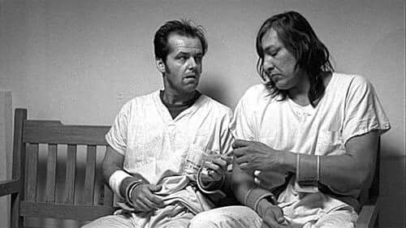

One of my main research interests lies in the area of _homotopy type theory and semantics of dependent type theory_. I am particularly interested in propositional (also know in the literature as weak, objective, axiomatic) type theory, where computation rules are all explicit. I study such formal systems via categorical semantics methods, in order to deduce properties like property-likeness, completeness, coherence, relative consistency, and conservativity.

I have also been working on the notions of _hyperdoctrines_ and Grothendieck fibrations to approach the study of fragments of first-order logic, focusing on quantifier completions, the _dialectica construction_, and canonicity properties. 

Click [here](CV.pdf) for a _curriculum vitae_ and [here](researchstatement.pdf) for a _research statement_.

 

<strong>Ongoing research.</strong>

<ul>
<li> <em>Dialectica type theories</em>. Together with Valeria de Paiva, <a href='https://trottadavide.github.io/'>Davide Trotta</a>, and <a href='https://sites.google.com/view/jonathanweinberger'>Jonathan Weinberger</a>.</li>
<li> <em>Semantics of Spatio-temporal logic</em>. Together with <a href='https://davidecaste.github.io/'>Davide Castelnovo</a> and Marino Miculan.</li>
<li> <em>Constructive set theories within dependent type theory</em>. Together with <a href='https://sites.google.com/view/emanuelefrittaion/home'>Emanuele Frittaion</a>.</li>
<li> <em>Type constructors as algebras</em>.</li>
<li> <em>Torsion theories and dependent types</em>. Together with Federico Campanini.</li>
<li> <em>Coherence for path categories</em>. Together with <a href='https://www.otten.co/'>Daniël Otten</a> and Benno van den Berg. <a href='https://www.youtube.com/watch?v=a6JNebaYXgU&list=PLu4STGsfbix9vBUvLDbti64_3hIsoK0-R&index=11&t=1164s&pp=iAQB'>YouTube presentation here</a>.</li>
</ul>

 <!-- Adds 20px space -->

<strong>Publications and preprints (<a href='https://arxiv.org/search/advanced?advanced=&terms-0-operator=AND&terms-0-term=Spadetto%2C+Matteo&terms-0-field=author&classification-mathematics=y&classification-physics_archives=all&classification-include_cross_list=include&date-filter_by=all_dates&date-year=&date-from_date=&date-to_date=&date-date_type=submitted_date&abstracts=show&size=50&order=-announced_date_first'>arXiv versions here</a>)</strong>

<ul>
<li> <strong>[<em>Preprint</em>]</strong> <em>A biequivalence of path categories and axiomatic Martin Löf type theories</em>. October 2024. Together with Daniël Otten.</li>
<li> <strong>[<em>Preprint</em>]</strong> <em>Towards propositional dependent sums in intensional and propositional dependent type theory</em>. January 2024.</li>
<li> <strong>[<em>Preprint</em>]</strong> <em>Relating homotopy equivalences to conservativity in dependendent type theories with propositional computation</em> <a href='https://arxiv.org/abs/2303.05623v2'>[2303.05623v2]</a>. March 2023.</li>
<li> <strong>[<em>Journal paper</em>]</strong> <em>Dialectica principles via Gödel doctrines</em> <a href='https://arxiv.org/abs/2205.07093'>[2205.07093v1]</a>. <a href='https://www.sciencedirect.com/science/article/pii/S0304397523000051?utm_campaign=STMJ_AUTH_SERV_PUBLISHED&utm_medium=email&utm_acid=265759211&SIS_ID=&dgcid=STMJ_AUTH_SERV_PUBLISHED&CMX_ID=&utm_in=DM333744&utm_source=AC_'>Theoretical Computer Science</a>. May 2022. Together with Davide Trotta and Valeria de Paiva.</li>
<li> <strong>[<em>Refereed conference paper</em>]</strong> <em>Dialectica logical principles</em> <a href='https://arxiv.org/abs/2109.08064'>[2109.08064v1]</a>. <a href='https://link.springer.com/chapter/10.1007/978-3-030-93100-1_22'>Proceedings of Logical Foundations of Computer Science 2022</a>. September 2021. <strong><em>Extended version</em></strong> → <strong>[<em>Journal paper</em>]</strong> <em>Dialectica logical principles: not only rules</em>. <a href='https://academic.oup.com/logcom/advance-article/doi/10.1093/logcom/exac079/6795172?searchresult=1'>Journal of Logic and Computation (LFCS 2022 post-conference volume)</a>. March 2022. Together with Davide Trotta and Valeria de Paiva.</li>
<li> <strong>[<em>Refereed conference paper</em>]</strong> <em>The Gödel fibration</em>. <a href='https://drops.dagstuhl.de/opus/volltexte/2021/14527/'>Proceedings of Mathematical Foundations of Computer Science 2021</a>. August 2021. <strong><em>Extended version</em></strong> → <strong>[<em>Preprint</em>]</strong> <em>The Gödel fibration</em> <a href='https://arxiv.org/abs/2104.14021'>[2104.14021v1]</a>. April 2021. Together with Davide Trotta and Valeria de Paiva.</li>
<li> <strong>[<em>Preprint</em>]</strong> <em>Quantifier completions, choice principles and applications</em> <a href='https://arxiv.org/abs/2010.09111v3'>[2010.09111v3]</a>. Submitted. October 2020. Together with Davide Trotta.</li>
</ul>

<strong>Selected talks in conferences, workshops, seminars</strong>

<ul>
<li> <em>Higher dimensional semantics of propositional theories of dependent types</em>. XVIII Incontro di Logica AILA. Udine, September 2024.</li>
<li> <em>Towards the coherence of the semantics of propositional identities</em>. Nottingham Functional Programming Lunch. Nottingham, Februrary 2024.</li>
<li> <em>Coherence in the semantics of dependent types</em>. Leeds Postgraduate Logic Seminar. Leeds, June 2023.</li>
<li> <em>Coherence for Extensional, Intensional and Propositional Identities</em>. Category Theory Lunch. Leeds & Manchester, June 2023.</li>
<li> <em>What is a dependent type theory?</em> <a href='https://leeds-maths-pgr.github.io/conf-2023/'>Leeds Maths PGR Conference 2023</a>. Leeds, June 2023.</li>
<li> <em>Strictifying Path Categories</em>. <a href='https://events.math.unipd.it/WDF2023/'>[Workshop on Doctrines & Fibrations]</a>. <a href='https://www.youtube.com/watch?v=a6JNebaYXgU&list=PLu4STGsfbix9vBUvLDbti64_3hIsoK0-R&index=13'>YouTube Recording</a>. <a href='https://events.math.unipd.it/WDF2023/slides/SPADETTO.pdf'>[Slides]</a>. Padua, June 2023.</li>
<li> <em>Propositional dependent type theories: a conservativity result for homotopy elementary types</em>. <a href='https://hott.github.io/HoTT-2023//'>Homotopy Type Theory 2023</a>. <a href='https://hott.github.io/HoTT-2023/slides/spadetto.pdf'>Slides</a>. Pittsburgh, May 2023.</li>
<li> <em>Weak type theories: a conservativity result for homotopy elementary types</em>. <a href='https://dutchcats.github.io/'>DutchCATS</a>. Amsterdam, May 2023.</li>
<li> <em>A conservativity-like result for a propositional type theory</em>. <a href='https://progetto-itaca.github.io/ItaCa-22/'>3rd ItaCa Workshop</a>. <a href='https://www.youtube.com/watch?v=y03fvYo_GRQ'>YouTube Recording</a>. Pisa, December 2022.</li>
<li> <em>Dialectica: fibrations and logical principles</em>. <a href='https://msp.cis.strath.ac.uk/act2022/'>Applied Category Theory 2022</a>. <a href='https://youtu.be/vbEtgFRiJ7U?t=18330'>YouTube Recording</a>. <a href='https://msp.cis.strath.ac.uk/act2022/slides/ACT2022_slides_8242.pdf'>Slides</a>. Glasgow, July 2022.</li>
<li> <em>Propositional in Dependent Type Theory</em>. <a href='https://sites.google.com/view/som-pgr-conference22/home?authuser=0'>Leeds Maths PGR Conference 2022</a>. Leeds, June 2022.</li>
<li> <em>Towards the notion of Propositional Dependent Sum Types</em>. Proofs, Constructions, Computations and Categories. Leeds, February 2022.</li>
<li> <em>Dialectica completion & dialectica logical principles</em>. <a href='https://conferences.leeds.ac.uk/yamcats/meeting-26/'>26th Yorkshire and Midlands Category Theory Seminar</a>. <a href='http://conferences.leeds.ac.uk/yamcats/wp-content/uploads/sites/84/2022/04/yamcats-26-spadetto.pdf'>Slides</a>. Birmingham, January 2022.</li>
<li> <em>Dialectica completion & Gödel fibrations</em>. <a href='https://genoa-logic-group.github.io/itaca-workshop-2021/'>2nd ItaCa Workshop</a>. Genoa, December 2021.</li>
<li> <em>Dialectica logical principles</em>. <a href='https://www.cl.cam.ac.uk/events/syco/8/'>Eighth Symposium on Compositional Structures</a>. Tallinn, December 2021.</li>
<li> <em>On the notions of exact completion</em>. Leeds Postgraduate Logic Seminar. Leeds, November 2021.</li>
<li> <em>Existential, universal and dialectica completion</em>. Proofs, Constructions, Computations and Categories. Leeds, November 2021.</li>
<li> <em>Regular (first-order) logic symbols & doctrines</em>. Groningen Mathematics PhD Seminar. Groningen, October 2021.</li>
<li> <em>The Gödel Fibration</em>. <a href='https://www.cl.cam.ac.uk/events/act2021/'>Applied Category Theory 2021</a>. <a href='https://www.cl.cam.ac.uk/events/act2021/slides/ACT_2021_slides_21.pdf'>Poster</a>. Cambridge, July 2021.</li>
<li> <em>Quantifier completions of doctrines</em>. <a href='http://web.science.mq.edu.au/groups/coact/seminar/CaCS2021/'>Categories and Companions Symposium 2021</a>. <a href='https://www.youtube.com/watch?v=1RajMGazetE&t=953s'>YouTube Recording</a>. Sydney, June 2021.</li>
</ul>

<strong>Visiting activities</strong>

<ul>
<li> **ILLC, Amsterdam**, the Netherlands. _Host_ Benno van den Berg. April-May 2023.</li>
<li> **University of Padua**, Italy. _Host_ Maria Emilia Maietti. December 2022.</li>
</ul>

<strong>Some links and stuff</strong>

<ul>
<li> [Leeds SoM account](https://eps.leeds.ac.uk/maths/pgr/8476/matteo-spadetto)</li>
<li> [Google Scholar account](https://scholar.google.com/citations?user=gTJ-1CwAAAAJ&hl=en)</li>
<li> [ResearchGate account](https://www.researchgate.net/profile/Matteo-Spadetto)</li>
<li> [ORCID](https://orcid.org/0000-0002-6495-7405)</li>
<li> [Mathematics Stack Exchange account](https://math.stackexchange.com/users/531071/matteo-spadetto?tab=profile)</li>
<li> [An introduction to doctrines](A_gentle_introduction_to_the_study_of_mathematical_logic_via_doctrines.pdf)</li>
<li> [An introduction to TQFT](TQFT.pdf)</li>
<li> [Master's thesis](Generalised_Gluing_and_Exact_Completion_of_Path_Categories___Current_Version.pdf)</li>
<li> [Some _sciarade_ (charades)](Sciarade.pdf)</li>
<li> [Curriculum vitæ](CV.pdf)</li>
<li> [Research statement](researchstatement.pdf)</li>
</ul>

 

#####  _A portrait of me and my collaborator working together._
